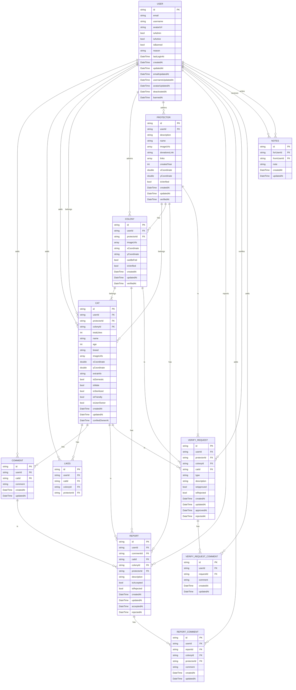

# Backend Project

A modern Node.js backend API with Express.js, TypeScript, MongoDB, Redis cache, and clean service separation.

## Features

- **TypeScript**: Full TypeScript support with strict type checking
- **MVC Architecture**: Clean separation of concerns with Models, Controllers, and Services
- **Express.js**: Fast, unopinionated web framework
- **MongoDB**: Flexible, scalable NoSQL database
- **Redis Cache**: High-performance caching layer for fast reads
- **Service Separation**: Interface, database, and cache service layers
- **CORS Support**: Cross-origin resource sharing enabled
- **Error Handling**: Comprehensive error handling middleware
- **Environment Configuration**: Environment variable management
- **Health Checks**: Built-in health monitoring endpoints
- **Request Logging**: Automatic request logging
- **Graceful Shutdown**: Proper server shutdown handling
- **Swagger Documentation**: Interactive API documentation with OpenAPI 3.0
- **User Authentication**: Email-based authentication with JWT cookies
- **Rate Limiting**: Protection against brute force attacks (production only)
- **NSFW Content Filtering**: AI-powered content moderation for cat images using TensorFlow.js and NSFW.js

## Project Structure

```
src/
├── config/          # Configuration files
├── controllers/     # Request handlers (Controllers)
├── middleware/      # Express middleware
├── models/          # Data models
├── routes/          # Route definitions
├── services/
│   ├── interfaces/      # Service interfaces (contracts)
│   ├── implementations/ # Service implementations (DB, cache)
│   └── ...              # Main service entry points
├── types/           # TypeScript type definitions
├── utils/           # Utility functions (MongoDB, Redis, etc.)
├── app.ts           # Express app setup
└── server.ts        # Server entry point
```

## Database Schema

The application uses MongoDB with the following entity relationships:



## Installation

1. Install dependencies:
```bash
npm install
```

2. Create a `.env` file in the root directory:
```bash
# Server Configuration
PORT=3000
NODE_ENV=development
CORS_ORIGINS=http://localhost:8000,https://spottingcats.com

# Security Configuration
TRUST_PROXY=true

# Database Configuration
MONGO_URL=mongodb://localhost:27017/your-db
MONGO_DB_NAME=your-db
REDIS_URL=redis://localhost:6379

# JWT Configuration
JWT_SECRET=your-super-secret-jwt-key-change-in-production

# Email Configuration (SMTP)
SMTP_HOST=smtp.gmail.com
SMTP_PORT=587
SMTP_USER=your-email@gmail.com
SMTP_PASS=your-app-password
SMTP_FROM=your-email@gmail.com

# Admin Configuration
ADMIN_EMAIL_WHITELIST=admin@example.com,superuser@example.com
```

## Development

### Development mode (with auto-restart):
```bash
npm run dev
```

### Build the project:
```bash
npm run build
```

### Production mode:
```bash
npm start
```

### Clean build artifacts:
```bash
npm run clean
```

## API Documentation

### Interactive Swagger Documentation
Access the complete interactive API documentation at:
```
http://localhost:3000/api-docs
```

The Swagger UI provides:
- Interactive testing of all endpoints
- Request/response examples
- Authentication support
- Schema definitions
- Error documentation

### Secure Email Change Flow

The application implements a secure two-step email change process:

1. **Initiate Email Change** (`PUT /api/v1/users/email`)
   - User provides new email address
   - System validates email format and availability
   - System checks 90-day cooldown period
   - Verification code is sent to the new email address
   - Email change request is stored with 10-minute expiration

2. **Verify Email Change** (`POST /api/v1/users/email/verify`)
   - User provides verification code from new email
   - System validates code against stored request
   - Email address is updated if verification succeeds
   - User's session is maintained with updated authentication token
   - Email change request is cleaned up

**Security Features:**
- **Verification Codes**: 6-digit codes sent to new email address
- **10-minute Expiration**: Codes expire after 10 minutes
- **Single Use**: Codes can only be used once
- **90-day Cooldown**: Users can only change email once every 90 days
- **Automatic Cleanup**: Email change requests are cleaned up when users are deleted/banned

### API Endpoints

#### Authentication
- **POST** `/api/v1/users/send-code` - Send verification code to email
- **POST** `/api/v1/users/verify-code` - Verify code and authenticate user
- **POST** `/api/v1/users/logout` - Logout user

#### User Management
- **GET** `/api/v1/users/:username` - Get user by username (public access, returns limited user fields)
- **GET** `/api/v1/users/profile` - Get current user profile (protected)
- **PUT** `/api/v1/users/username` - Update user's username (30-day limit, protected)
- **PUT** `/api/v1/users/email` - Initiate email address change (sends verification code, 90-day limit, protected)
- **POST** `/api/v1/users/email/verify` - Verify email change with verification code (protected)
- **PUT** `/api/v1/users/avatar` - Update user's avatar URL (30-day limit, protected)
- **POST** `/api/v1/users/deactivate` - Deactivate user account (protected)
- **DELETE** `/api/v1/users/delete` - Permanently delete user account (protected)

#### Admin Management (Admin Only)
- **POST** `/api/v1/users/ban` - Ban a user by username
- **POST** `/api/v1/users/unban` - Unban a user by username
- **GET** `/api/v1/users/admin/all` - Get all users
- **POST** `/api/v1/users/admin/cleanup` - Manually trigger cleanup of old deactivated users (rate limited)

#### Cat Management
- **POST** `/api/v1/cats` - Create a new cat
- **GET** `/api/v1/cats` - List all cats with filtering and pagination
- **GET** `/api/v1/cats/:id` - Get a cat by ID
- **PUT** `/api/v1/cats/:id` - Update a cat
- **DELETE** `/api/v1/cats/:id` - Delete a cat

#### Health Check
- **GET** `/api/v1/health` - Basic health status
- **GET** `/api/v1/health/detailed` - Detailed health with system info
- **GET** `/api/v1/health/database` - Database connection status

#### Cache Management
- **POST** `/api/v1/cache/flush` - Flush all cache data
- **GET** `/api/v1/cache/:key` - Get cache information for a key
- **POST** `/api/v1/cache/:key` - Set cache data for a key
- **DELETE** `/api/v1/cache/:key` - Delete cache data for a key

#### Hello Endpoints
- **GET** `/` - Root welcome message
- **GET** `/api/v1/hello` - Simple hello message
- **GET** `/api/v1/hello/welcome` - Welcome message

## Example Responses

### User by Username Endpoint (Basic)
```json
{
  "success": true,
  "data": {
    "user": {
      "username": "happycat",
      "avatarUrl": "https://example.com/avatar.jpg",
      "isAdmin": false,
      "isInactive": false,
      "isBanned": false,
      "lastLoginAt": "2024-01-15T10:30:00.000Z",
      "createdAt": "2024-01-01T00:00:00.000Z"
    }
  },
  "message": "User retrieved successfully"
}
```

### Cat List Endpoint
```json
[
  {
    "id": "...",
    "name": "Whiskers",
    "age": 2,
    "breed": "Tabby"
  }
]
```

### Health Check Endpoint
```json
{
  "success": true,
  "message": "Health check successful",
  "data": {
    "status": "OK",
    "timestamp": "2024-01-01T12:00:00.000Z",
    "uptime": 123.456,
    "version": "1.0.0",
    "environment": "development"
  },
  "timestamp": "2024-01-01T12:00:00.000Z"
}
```

### Database & Cache Status
```json
{
  "success": true,
  "message": "Database status retrieved",
  "data": {
    "available": true,
    "configured": true,
    "databaseName": "your-db",
    "redis": {
      "configured": true,
      "available": true
    }
  }
}
```

## Dependencies

### Production
- `express`: Web framework
- `cors`: Cross-origin resource sharing
- `dotenv`: Environment variable management
- `mongodb`: MongoDB driver
- `redis`: Redis client
- `swagger-jsdoc`: Swagger documentation generator
- `swagger-ui-express`: Swagger UI for Express
- `jsonwebtoken`: JWT authentication
- `nodemailer`: Email sending
- `bcryptjs`: Password hashing
- `cookie-parser`: Cookie parsing
- `express-rate-limit`: Rate limiting
- `unique-username-generator`: Automatic username generation
- `helmet`: Security headers
- `@tensorflow/tfjs-node`: TensorFlow.js for Node.js (NSFW model inference)
- `nsfwjs`: NSFW content detection library

### Development
- `typescript`: TypeScript compiler
- `@types/node`: Node.js type definitions
- `@types/express`: Express type definitions
- `@types/cors`: CORS type definitions
- `@types/mongodb`: MongoDB type definitions
- `@types/swagger-jsdoc`: Swagger JSDoc type definitions
- `@types/swagger-ui-express`: Swagger UI Express type definitions
- `@types/jsonwebtoken`: JWT type definitions
- `@types/nodemailer`: Nodemailer type definitions
- `@types/bcryptjs`: Bcrypt type definitions
- `@types/cookie-parser`: Cookie parser type definitions
- `ts-node`: TypeScript execution engine
- `nodemon`: Auto-restart server during development

## TypeScript Configuration

The project uses strict TypeScript configuration with:
- Path mapping for clean imports
- Source maps for debugging
- Declaration files generation
- Strict null checks and function types

## Email Configuration

The application uses Nodemailer for sending emails (verification codes, welcome emails, etc.). 

### SMTP Configuration
The email service requires the following environment variables:
- `SMTP_HOST`: SMTP server host (default: `smtp.gmail.com`)
- `SMTP_PORT`: SMTP server port (default: `587`)
- `SMTP_USER`: SMTP username/email address
- `SMTP_PASS`: SMTP password or app password
- `SMTP_FROM`: Sender email address (defaults to `SMTP_USER`)

### Gmail Setup
For Gmail, you'll need to:
1. Enable 2-factor authentication on your Google account
2. Generate an App Password (Google Account → Security → App Passwords)
3. Use the App Password in `SMTP_PASS`

### Production Considerations
- Use a dedicated email service (SendGrid, Mailgun, etc.) for production
- Ensure the `SMTP_FROM` address is properly configured and verified
- Monitor email delivery rates and bounce rates
- Consider using email templates for consistent branding

## NSFW Content Filtering

The application includes AI-powered content moderation for cat images using TensorFlow.js and NSFW.js. This feature automatically detects and blocks inappropriate content when users create or update cats with images.

### How It Works

1. **Model Loading**: The NSFW model is loaded at application startup using TensorFlow.js
2. **Image Validation**: When users create or update cats with `imageUrls`, the system:
   - Fetches each image from the provided URLs
   - Processes them through the NSFW classification model
   - Calculates a confidence score for inappropriate content
   - Blocks the request if NSFW content is detected

3. **Classification Categories**: The model classifies images into 5 categories:
   - **Drawing**: Artistic or cartoon content
   - **Hentai**: Anime-style inappropriate content
   - **Neutral**: Safe, appropriate content
   - **Porn**: Explicit adult content
   - **Sexy**: Suggestive but not explicit content

4. **Threshold Configuration**: The system uses a configurable threshold (default: 0.5) for the combined score of Porn + Sexy categories

### Implementation Details

- **Service**: `src/services/nsfwService.ts` - Handles model loading and image classification
- **Middleware**: `src/middleware/nsfwValidation.ts` - Validates images in cat creation/update requests
- **Routes**: Applied to `POST /api/v1/cats` and `PUT /api/v1/cats/:id` endpoints

### Error Handling

- **Model Not Ready**: If the NSFW model fails to load, requests proceed without validation
- **Image Fetch Errors**: Invalid URLs or network issues are logged and reported
- **Classification Errors**: TensorFlow processing errors are handled gracefully
- **Graceful Degradation**: The system continues to function even if NSFW validation fails

### Configuration

The NSFW filter can be configured by modifying the threshold in `src/services/nsfwService.ts`:

```typescript
// Adjust the threshold (0.0 to 1.0)
const isNSFW = nsfwScore > 0.5; // More strict: 0.3, Less strict: 0.7
```

## Architecture

### Service Separation Pattern
- **Interface Layer**: Defines contracts for services (e.g., `ICatService`)
- **Database Layer**: Handles MongoDB operations (e.g., `CatDatabaseService`)
- **Cache Layer**: Handles Redis caching and wraps the database service (e.g., `CatCacheService`)
- **Main Service**: Exposes the cache service as the main entry point (e.g., `CatService`)

### API Documentation
The project uses Swagger/OpenAPI 3.0 for comprehensive API documentation:
- **Interactive Documentation**: Browse and test endpoints at `/api-docs`
- **JSDoc Integration**: Documentation generated from code comments
- **Authentication Support**: Cookie-based auth for protected endpoints
- **Schema Definitions**: Complete data models and response formats
- **Error Documentation**: Detailed error responses and status codes

For detailed information about the Swagger setup, see [SWAGGER_SETUP.md](./SWAGGER_SETUP.md).

### Middleware Stack
1. CORS handling
2. Body parsing
3. Request logging
4. Route handling
5. Error handling
6. 404 handling

## Environment Variables

| Variable | Default | Description |
|----------|---------|-------------|
| `PORT` | `3000` | Server port |
| `NODE_ENV` | `development` | Environment mode |
| `CORS_ORIGINS` | `*` | CORS origin setting |
| `TRUST_PROXY` | `false` | Trust proxy for rate limiting (set to `true` when behind reverse proxy) |
| `MONGO_URL` | - | MongoDB connection string |
| `MONGO_DB_NAME` | - | MongoDB database name |
| `REDIS_URL` | - | Redis connection string |
| `JWT_SECRET` | - | Secret key for JWT token signing |
| `SMTP_HOST` | `smtp.gmail.com` | SMTP server host |
| `SMTP_PORT` | `587` | SMTP server port |
| `SMTP_USER` | - | SMTP username/email |
| `SMTP_PASS` | - | SMTP password/app password |
| `SMTP_FROM` | `SMTP_USER` | Sender email address |